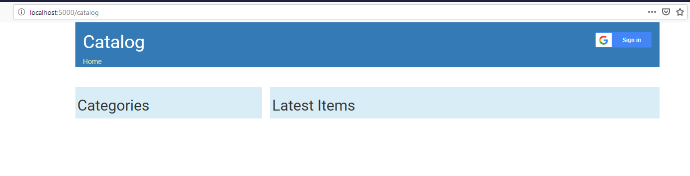
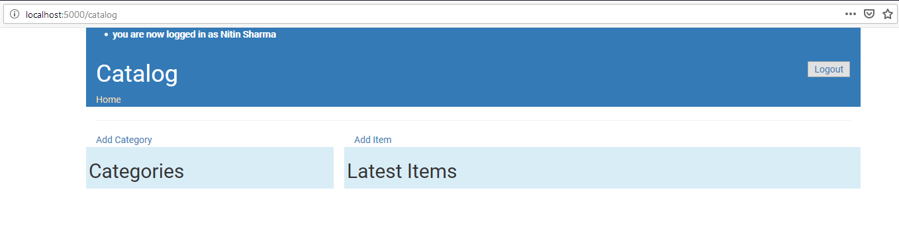
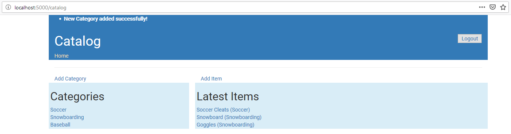

# Catalog Service

This service displays the Sports categories and items under each category.
Users have to login to add a Category or item. A user can edit/delete only those items or categories which he/she has added.
So a user can add a new item only to a Category that he/she has added.

## How to run

### Dependencies
#### Virtual Machine
You need the VM @ https://github.com/udacity/fullstack-nanodegree-vm to run this service.
This has all required packages & DB pre-installed.
Specifically this service requires:
1. Postgres DB
2. Python 3 and packages: Flask, SqlAlchemy, oauth2client and httplib2

So please check that these are installed before proceeding to below steps.

#### First time setup
Copy the directory catalog to vagrant. Then cd into it.

Before first run you need to setup the DB so run the database_setup.py as shown below:

`$python database_setup.py`

This will create a DB named catalog, with the following tables:
1. **categories** : Category information.
2. **items** : Information of each item and relationship to Category.
3. **users** : User information.

#### Running the service
Once the DB is setup, run the service as shown below:

`$python catalog_service.py`

If all goes well it'll start the server which can be accessed from a browser on your host machine by visting 
localhost:5000 or localhost:5000/catalog.

Initially as the DB is empty so it'll not show any entries. You need to login and start adding Categories and Items.

Click on the login button on top right, and login using Google credentials. Once logged in you'll see the option to add category & item, as shown below

 
 
After adding items & categories the page may look like below:

 
 
 Now you can select any category or item to edit or delete it.